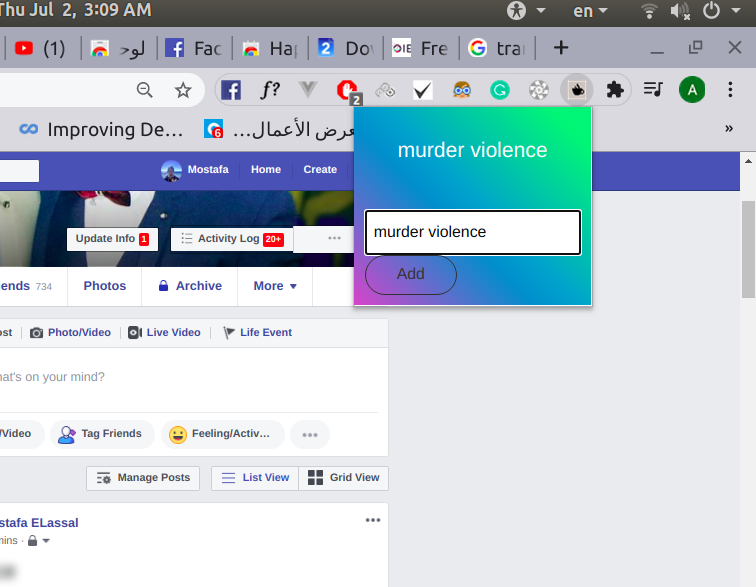
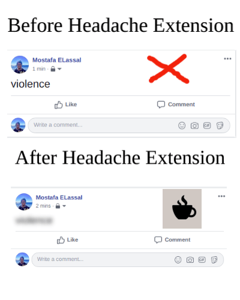

# link for this extension:
https://chrome.google.com/webstore/detail/headache/hkabbdifibdddbgninhiepliloeegndf?hl=ar&authuser=2

# original code for getting facebook posts is here:
https://github.com/microsmsm/HappyZoneExtension

# headache_extension_google
this extension enables a user to type some words, and it will blur all posts including these words on Facebook Timeline.

